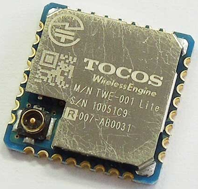

# ATS programing on ToCoNet

## Demo code

T.B.D.

## Hardware: [TWE-Lite](http://mono-wireless.com/jp/products/index.html)



You can get it from モノワイヤレス株式会社 (only for Japan).

* [TWE-Lite](http://mono-wireless.com/jp/products/TWE-001Lite.html)
* [TWE-Lite DIP](http://mono-wireless.com/jp/products/TWE-Lite-DIP/index.html)

And also you need firemware writer.

* [TWE-Lite R](http://mono-wireless.com/jp/products/TWE-Lite-R/index.html)

## Setup environment
### [Debian GNU/Linux](https://www.debian.org/)

You need [ToCoNet SDK](http://mono-wireless.com/jp/products/ToCoNet/TWESDK.html) to build this product.

```
$ wget ftp://tocos-wireless.com/TWESDK_201408-31-2/TWESDK_201408-31_Linux.tar.bz2
$ tar xf TWESDK_201408-31_Linux.tar.bz2
$ export TWESDK=`pwd`/TWESDK
```

### Mac OS X

T.B.D.

### Windows

T.B.D.

## How to build

Simply type "make" on demo directory.

```
$ git clone https://github.com/fpiot/toconet-ats.git
$ cd toconet-ats/demo/Samp_PingPong
$ ls -l PingPong/Build/*.bin
-rwxr-xr-x 1 kiwamu kiwamu 51444 Dec 10 21:32 PingPong/Build/Samp_PingPong_PingPong_JN5164_0_1_4.bin*
```

## Write to the flash

T.B.D.

## How to debug using gdb

T.B.D.
